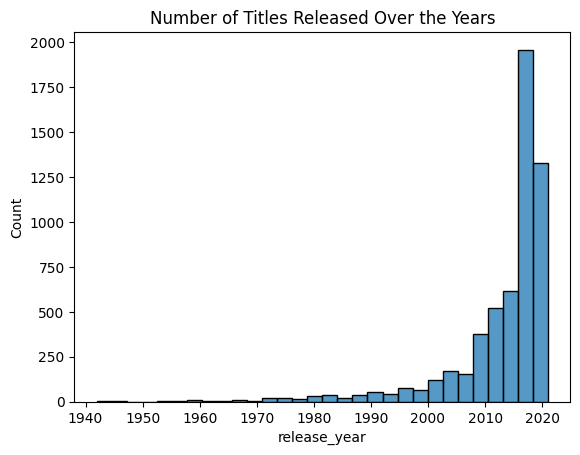

# Project Overview
Netflix has emerged as a global leader in online streaming, offering thousands of movies and TV shows across diverse regions.
This project performs an Exploratory Data Analysis (EDA) on the Netflix Titles Dataset to uncover insights about:

    - Content distribution across movies and TV shows
    - Regional and genre-based preferences
    - Release year trends and seasonality
    - Key contributors (directors, actors)

# Dataset
Source: Netflix Titles Dataset – Kaggle - https://www.kaggle.com/datasets/shivamb/netflix-shows?resource=download
Size: ~8,800 titles (movies & TV shows)
Columns include: title, director, cast, country, release year, rating, duration, genre, date added

# Tech Stack
Python: Numpy, Pandas, Matplotlib.pyplot, Seaborn, Wordcloud

IDE: Jupyter Notebook

# Key Questions Explored
1. How has the number of Movies vs TV Shows evolved over the years?
2. Which countries produce the most Netflix content?
3. What are the most common genres? Do genre preferences differ across countries?
4. What patterns exist in movie duration and number of TV show seasons?
5. Are there seasonal trends in Netflix content release dates?
6. Who are the top recurring directors and actors on Netflix?

# Analysis & Visualizations
1. Movies vs TV Shows Distribution

2. Content Released Over Time

3. Seasonal Trends in Content Release

3. Top 10 Countries Producing Content

4. Genre Distribution (Word Cloud / Bar Chart)

5. Content Duration Patterns

6. Top Directors and Actors

# Key Insights

# How to Run
1. Clone this Repo

git clone https://github.com/Shreyak1999/Portfolio-Projects.git

cd Portfolio-Projects/EDA_Netflix_Titles

2. Install Dependencies

pip install -r requirements.txt

3. Open Notebook

jupyter notebook eda.ipynb

# Project Structure
Portfolio-Projects/

│── EDA_Netflix_Titles/

│     ├── eda.ipynb           # Jupyter notebook with full analysis

│     ├── images/             # saved plots for README

│     ├── README.md           # this file

│     └── requirements.txt    # libraries used

