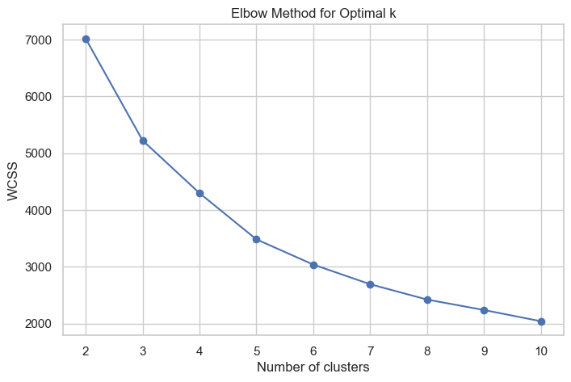
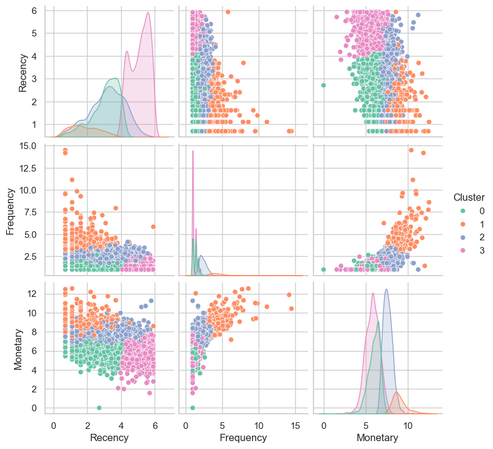
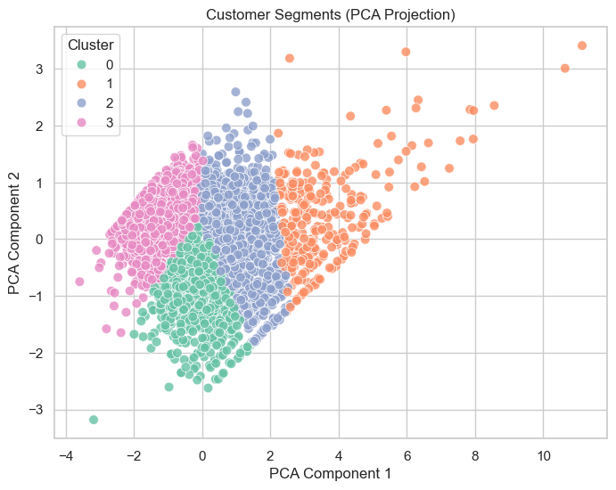

# 🛒 Customer Segmentation on Online Retail Dataset

## 📌 Project Overview
This project applies **unsupervised learning (clustering)** to segment customers of a UK-based online retail store into meaningful groups.  
The goal is to identify distinct customer profiles based on their **purchasing behavior** so businesses can tailor marketing strategies, improve customer retention, and optimize resource allocation.

---

## 🛠️ Tech Stack
- Python (pandas, numpy, scikit-learn)  
- Visualization (matplotlib, seaborn, plotly)  
- Clustering (KMeans, DBSCAN, Hierarchical)  

---

## 📊 Dataset
- Source: [UCI Online Retail Dataset](https://archive.ics.uci.edu/ml/datasets/online+retail)  
- Transactions from **Dec 2010 – Dec 2011** (~540,000 rows).  
- Features include:  
  - `InvoiceNo`: Transaction ID  
  - `StockCode`: Product ID  
  - `Description`: Product name  
  - `Quantity`: Units purchased  
  - `InvoiceDate`: Date of purchase  
  - `UnitPrice`: Price per item  
  - `CustomerID`: Unique customer identifier  
  - `Country`: Customer’s country  

---

## 🔧 Methodology
1. **Data Cleaning**  
   - Removed missing Customer IDs  
   - Removed negative quantities (returns)  
   - Created `TotalPrice = Quantity × UnitPrice`

2. **Feature Engineering (RFM Analysis)**  
   - **Recency (R):** Days since last purchase  
   - **Frequency (F):** Number of unique transactions  
   - **Monetary (M):** Total spending  

3. **Preprocessing**  
   - Log transformation of Monetary  
   - StandardScaler applied to R, F, M  

4. **Clustering**  
   - KMeans with Elbow method & Silhouette Score to determine `k`  
   - Compared alternative algorithms (DBSCAN, Hierarchical)  

5. **Visualization & Insights**  
   - Pairplots of clusters  
   - PCA/t-SNE for dimensionality reduction  

---

## 📈 Results
- Optimal number of clusters: **4**  
- Cluster summaries:  

| Cluster | Recency (days) | Frequency | Monetary (log spending) | Profile |
|---------|----------------|-----------|--------------------------|----------|
| **0** | 3.07 | 1.37 | 6.01 | Occasional but recent buyers |
| **1** | 1.87 | 4.54 | 9.03 | **VIP customers** – very recent, frequent, high spenders |
| **2** | 3.17 | 2.34 | 7.62 | Potential loyalists – moderate frequency & spending |
| **3** | 5.08 | 1.21 | 5.79 | At-risk customers – infrequent, lowest spending |

### 🔹 Business Insights
    - **Cluster 1 (VIPs):** Retain with loyalty rewards, premium offers  

    - **Cluster 2 (Potential Loyalists):** Encourage more purchases with discounts/personalized marketing  

    - **Cluster 0 (Occasional Buyers):** Re-engage via seasonal campaigns, email nudges 

    - **Cluster 3 (At-Risk):** Win-back strategies like special offers or surveys  

- **Silhouette Score:** ~0.3 (moderate separation)

---

## 🔎 PCA Analysis

To better visualize customer segments, I applied Principal Component Analysis (PCA) on the standardized Recency, Frequency, and Monetary (RFM) features.

PCA Component 1 (PC1):

- Strongly correlated with Frequency and Monetary.

- Interpreted as a measure of Overall Customer Value.

- Customers on the right side of the PCA plot represent frequent, high-spending buyers.

PCA Component 2 (PC2):

- Strongly correlated with Recency.

- Interpreted as a measure of Purchase Recency.

- Customers at the top of the PCA plot are recent purchasers, while those at the bottom have not purchased for a long time.

Cluster Separation in PCA Space:

- The 2D PCA projection clearly shows distinct customer groups.

- VIPs are located on the right (high value), while At-Risk customers cluster on the left with low frequency and monetary value.

- This dimensionality reduction helped validate that our clustering effectively captured meaningful behavioral differences.

---

## 📊 Visualizations
- Elbow Method for optimal clusters 

- Pairplot of RFM features colored by cluster  

- PCA 2D visualization of clusters  

---

## 📂 Repository Structure

│── Data 

    |- Online Retail.xlsx

|── images

│──notebook.ipynb

│── README.md

│── requirements.txt
